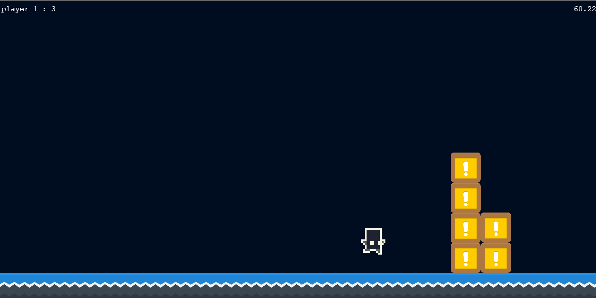

# FlatmatesFighters



## Running Examples Locally

Looking to run the examples locally?
Clone or download the repository. Make sure you have [node](https://nodejs.org/en/) installed. Open a terminal in the repository folder and run:

```
npm install
```

This will install the needed dependencies. Then you can run:

```
npm run build
npm install http-server -g
http-server
```

This will open up a browser with the examples served up.
